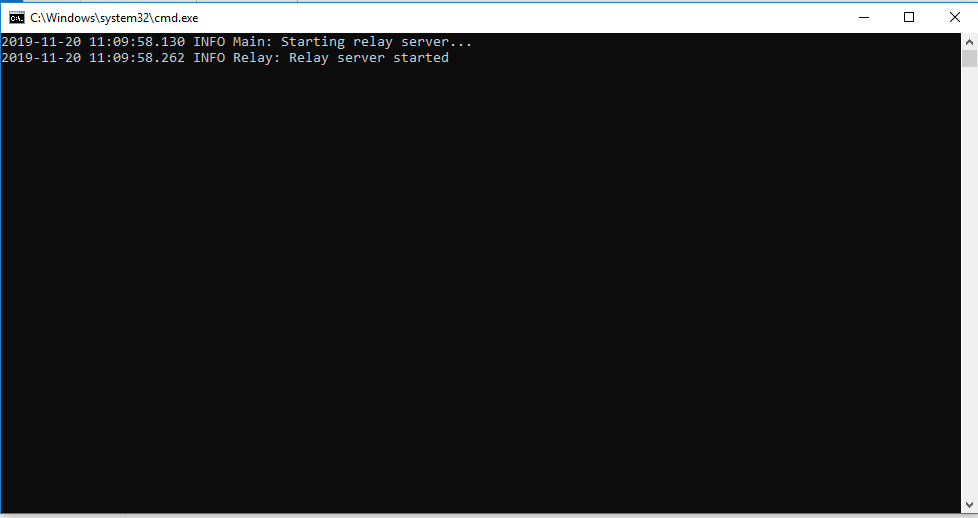
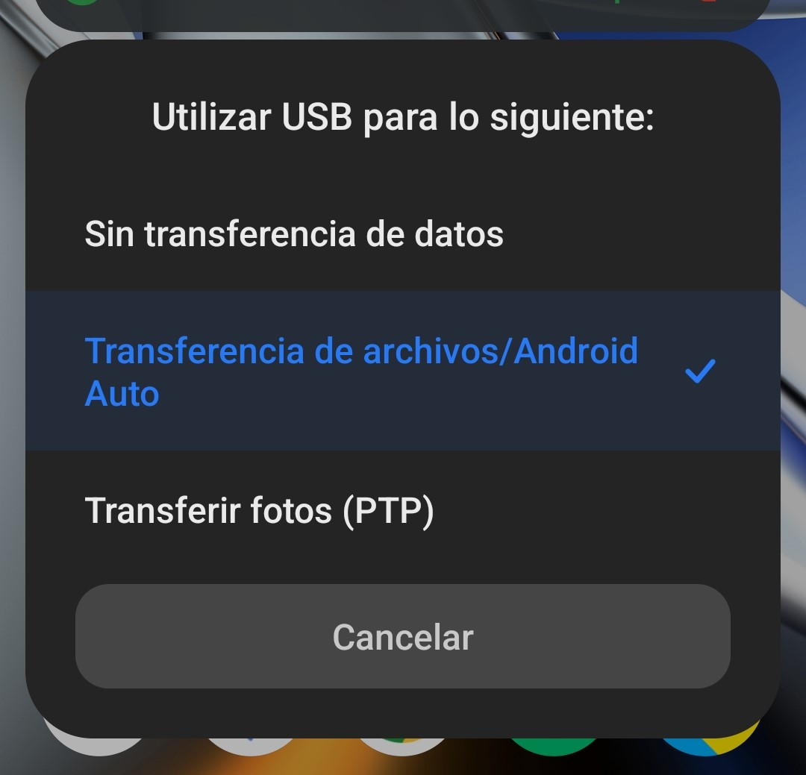
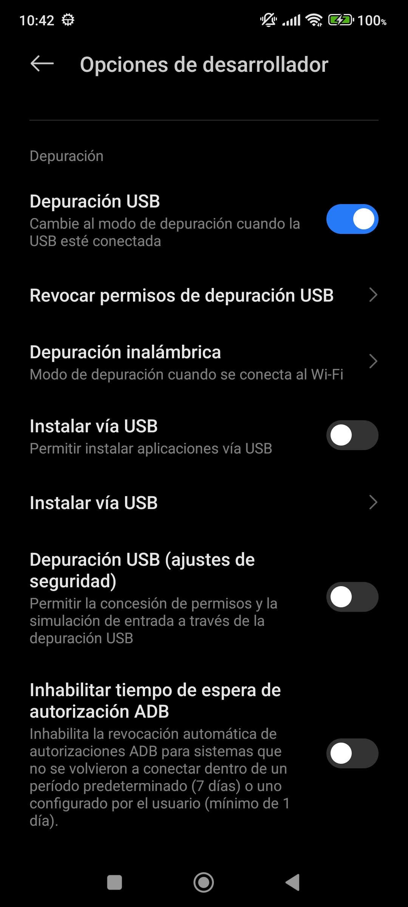
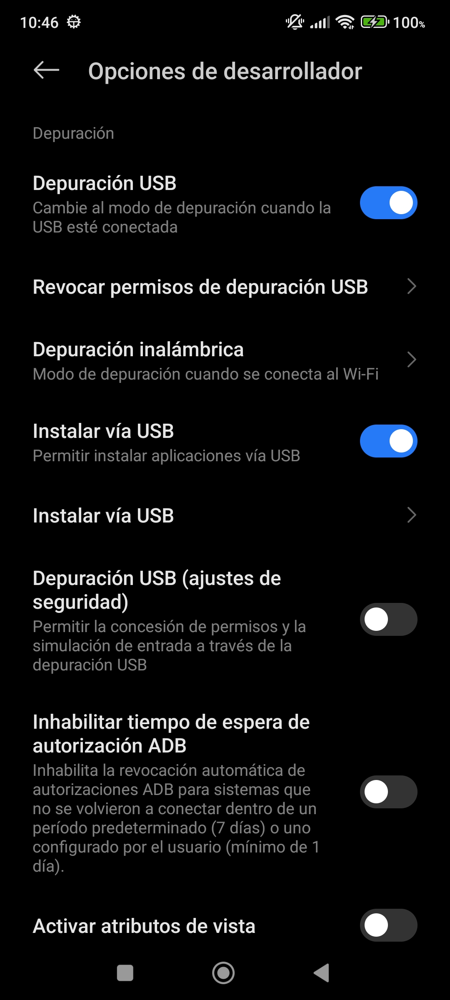
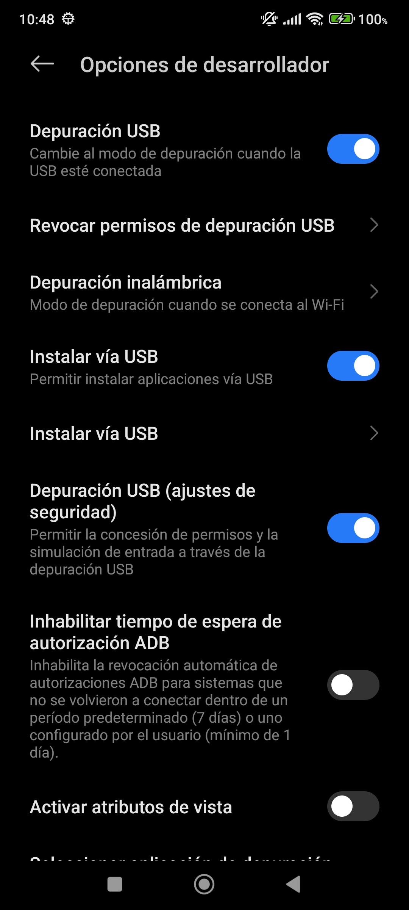
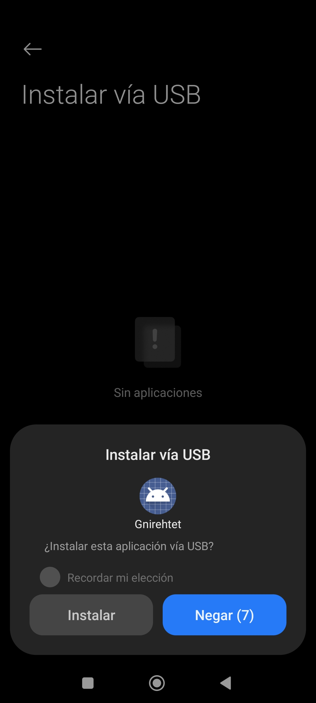

# 🌐 Internet de PC a Móvil  
### Basado en: [Genymobile/gnirehtet](https://github.com/Genymobile/gnirehtet)  
  

## 📌 ¿Para qué sirve?  
Este método es útil en las siguientes situaciones:  
1️⃣ Tu teléfono necesita conexión a Internet.  
2️⃣ Tu PC tiene Internet, pero no cuenta con Wi-Fi o hotspot.  
3️⃣ Tienes un cable USB para conectar el teléfono a la PC.  
4️⃣ Quieres compartir la conexión a Internet de tu PC con el teléfono.  

Sigue estos pasos para configurar la conexión:  

## 🛠️ **Cómo usarlo**  
📥 [Descarga el archivo ZIP (~9MB)](https://github.com/omkar-tenkale/Reverse-tethering-setup-Windows/archive/master.zip)  

### 1️⃣ Extrae y ejecuta el programa  
- Descomprime el archivo ZIP.  
- Haz doble clic en **START_ME_gnirehtet-autorun.cmd**.  

     

### 2️⃣ Conecta tu teléfono a la PC  
- Usa un cable USB.  
- Selecciona el modo **Transferencia de archivos** (no "Solo carga").  

     

### 3️⃣ Habilita la **Depuración USB** en tu dispositivo  
- Si no sabes cómo activarla, busca en Internet:  
  _"Cómo habilitar la depuración USB en [marca del dispositivo]"_ (ej. Xiaomi, Samsung, etc.).  
- Cuando aparezca un mensaje de advertencia, pulsa **ACEPTAR**.  

     

### 4️⃣ Activa la opción **Instalar vía USB**  
- En algunos dispositivos, será necesario iniciar sesión para activarla.  
- Se requiere una conexión a Internet para completar este paso.  

     

### 5️⃣ Concede permisos para la **Depuración USB (ajustes de seguridad)**  
- En dispositivos recientes, es necesario autorizar la instalación vía USB.  

     

### 6️⃣ Instalación automática de la app  
- Acepta la instalación en tu teléfono cuando se te solicite.  

     

### 7️⃣ Acepta la solicitud de conexión VPN  
- Aparecerá un cuadro de diálogo en tu teléfono.  
- Pulsa **Aceptar** para establecer la conexión.  

     

### 8️⃣ Verifica la conexión  
- Si ves el **icono de VPN** en la barra de estado, tu teléfono ya está conectado a Internet a través de la PC.  

     

✅ **¡Listo! Tu teléfono ya tiene acceso a Internet desde tu PC.** 🚀  
